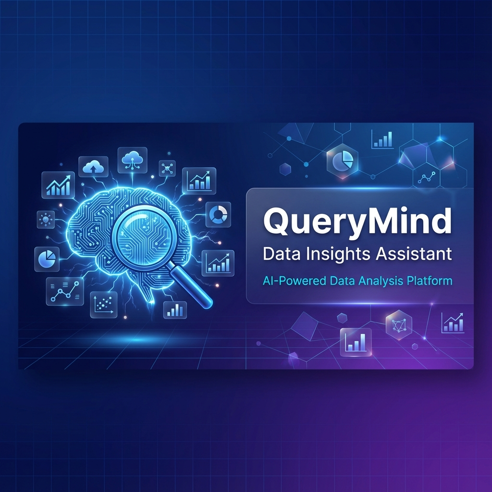
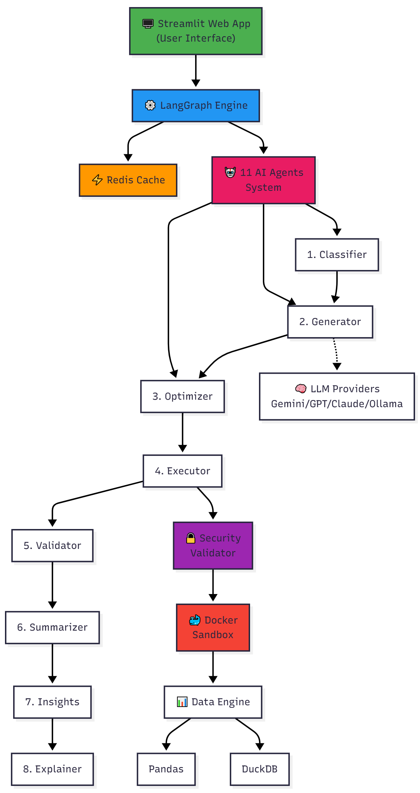

# 🧠 QueryMind: AI-Powered Data Analytics Assistant

**QueryMind** is an advanced AI agent system that transforms natural language questions into executable data analysis code. Built with **LangGraph**, **Streamlit**, and **Docker**, it provides a secure, scalable, and intelligent interface for exploring your data.



## ✨ Key Features

- **🗣️ Natural Language Interface**: Ask questions in plain English (e.g., "Show me sales trends by region").
- **🤖 Multi-Agent Architecture**: A sophisticated pipeline of 8 specialized AI agents working in concert:
    - **Classifier**: Determines query intent and complexity.
    - **Generator**: Writes precise Python/Pandas code.
    - **Optimizer**: Refines code for performance and best practices.
    - **Executor**: Runs code in a secure, isolated environment.
    - **Validator**: Checks results and handles errors automatically.
    - **Summarizer**: Translates technical outputs into business insights.
    - **Insight Generator**: Proactively suggests follow-up questions.
    - **Explanation Agent**: Explains the "why" and "how" behind the code.
- **⚡ Intelligent Caching**: **Redis-based semantic caching** instantly serves results for repeated or similar queries, reducing latency and LLM costs.
- **📊 Dynamic Visualizations**: Automatically generates interactive charts (Matplotlib/Seaborn) based on your data.
- **🔒 Secure Sandboxing**: All code execution happens inside isolated **Docker containers** with no network access.
- **📈 Scalable Data Engine**: Seamlessly handles small files (Pandas) and large 100GB+ datasets (DuckDB).
- **🧠 Transparent Reasoning**: View the full "Thinking Process" and agent workflow to trust the results.

## 🏗️ Architecture



## 🚀 Getting Started

### Prerequisites
- **Python 3.9+**
- **Docker Desktop** (Required for Redis and Code Execution)
- **Git**

### Installation

1.  **Clone the repository:**
    ```bash
    git clone https://github.com/yourusername/blend-360-project.git
    cd blend-360-project
    ```

2.  **Create a virtual environment:**
    ```powershell
    python -m venv venv
    .\venv\Scripts\Activate.ps1  # Windows
    # source venv/bin/activate # Mac/Linux
    ```

3.  **Install dependencies:**
    ```bash
    pip install -r requirements.txt
    ```

4.  **Configure Environment:**
    Create a `.env` file in the root directory:
    ```env
    GOOGLE_API_KEY=your_gemini_api_key_here
    # Optional: OPENAI_API_KEY, ANTHROPIC_API_KEY
    ```

### Running the Application

We provide a helper script to start everything (Redis + Streamlit) automatically:

**Windows:**
```powershell
.\start.ps1
```

**Linux/Mac:**
```bash
./start.sh
```

*This script will:*
1. *Start the Redis container (for caching).*
2. *Build the Execution Sandbox container (if missing).*
3. *Launch the Streamlit application.*

## 💡 Usage

1.  **Upload Data**: Use the sidebar to upload a CSV or Excel file.
2.  **Ask Questions**: Type your query in the chat box.
    - *Descriptive*: "What is the average revenue per customer?"
    - *Visual*: "Plot the distribution of sales by category."
    - *Complex*: "Identify the top 3 regions and their growth rate compared to last month."
3.  **Explore Results**:
    - View the answer and generated visualizations.
    - Expand **"View Analysis Details"** to see the generated code and agent reasoning.
    - Check **"Suggested Follow-up Questions"** for deeper analysis.

## 🔧 Configuration

Customize behavior in `config.yaml`:

```yaml
llm_provider: google  # Options: google, openai, anthropic, ollama
model_name: gemini-2.0-flash-exp

execution:
  max_parallel_containers: 5
  timeout_seconds: 30

data:
  engine: pandas  # Use 'duckdb' for large datasets
```

## 📂 Project Structure

```
blend-360-project/
├── app.py                 # Streamlit Frontend
├── config.yaml            # Configuration file
├── docker-compose.yml     # Redis service definition
├── requirements.txt       # Python dependencies
├── start.ps1              # Windows startup script
├── src/
│   ├── agents.py          # Agent implementations
│   ├── graph.py           # LangGraph workflow definition
│   ├── cache_manager.py   # Redis caching logic
│   ├── data_engine.py     # Data loading & processing
│   └── llm_factory.py     # LLM provider abstraction
├── docker/
│   └── Dockerfile         # Sandbox container definition
└── data/                  # Sample datasets
```

## 🛡️ Security

- **Prompt Injection Defense**: System prompts include guardrails against malicious inputs.
- **Code Validation**: Generated code is statically analyzed before execution.
- **Isolation**: No code runs on the host machine; everything is contained within Docker.

## 🤝 Contributing

Contributions are welcome! Please feel free to submit a Pull Request.
